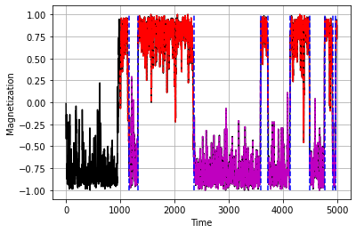

# Ising Model e Transizioni di Dominio

## Obiettivo
Questo progetto implementa una simulazione del modello di Ising bidimensionale per studiare la formazione e il cambiamento dei domini magnetici in funzione della dimensione del reticolo.

La simulazione utilizza un aggiornamento casuale degli spin secondo la regola di Metropolis, calcolando la magnetizzazione media nel tempo. La funzione Toti analizza la magnetizzazione per identificare i cambiamenti di dominio e conta il numero totale di domini presenti.

Vengono prodotti diversi grafici per visualizzare:

- L'andamento della magnetizzazione nel tempo, evidenziando i domini con colori alternati e linee tratteggiate.

- Il numero di domini in funzione della dimensione del reticolo L.

## Funzionalità principali

- Simulazione Monte Carlo del modello di Ising 2D.

- Analisi personalizzata dei domini magnetici con la funzione Toti.

- Visualizzazioni dettagliate per facilitare l'interpretazione dei risultati.

## Programmi utilizzati

- Python

- numpy

- matplotlib

- scipy 

## Esempi di grafici

## File presenti

- `ising_simulation.ipynb` — Codice principale
- `isingdomini.png` — Immagine della diviione in domini con i tratteggi per comprendere meglio
- `README.md` — Questo file

Il progetto è stato realizzato come esercizio personale di analisi dati.

~ Loris Manganiello
